# Spheer — Class Architecture Flow Diagram

> **Legend:**  
> 🟩 Existing & Keeping | 🟥 Phase 1 Removal | 🟦 Planned

---

## Full System Map

```mermaid
flowchart TD

    %% ══════════════════════════════════════════
    %% CORE SINGLETONS
    %% ══════════════════════════════════════════
    subgraph CORE["🪐 Core Singletons"]
        Player["Player.cs\n(Singleton — resources, XP, prestige, save/load)"]
        UIManager["UIManager.cs\n(Singleton — opens/closes all panels)"]
        AudioManager["AudioManager.cs\n(Singleton — plays sounds)"]
        EventManager["EventManager.cs"]
        PopupManager["PopupManager.cs\n(notification icon stack)"]
        TransactionManager["TransactionManager.cs\n(validates purchases)"]
        TutorialManager["TutorialManager.cs\n(first-time tutorial messages)"]
        PlacementManager["PlacementManager.cs\n(interactive building placement)"]
        WorldSpawner["WorldSpawner.cs\n(swaps world models)"]
    end

    %% ══════════════════════════════════════════
    %% SAVE SYSTEM
    %% ══════════════════════════════════════════
    subgraph SAVE["💾 Save System"]
        PlayerData["PlayerData.cs\n(serializable state snapshot)"]
        SaveSystem_["SaveSystem.cs\n(JSON read/write)"]
    end

    %% ══════════════════════════════════════════
    %% UI PANELS
    %% ══════════════════════════════════════════
    subgraph UI["🖥️ UI Panels"]
        MenuPanel["MenuPanel.cs\n(abstract base — all panels extend this)"]
        MainMenu["MainMenu.cs"]
        ShopPanel["ShopPanel.cs"]
        WorldsPanel["WorldsPanel.cs"]
        ResearchPanel["ResearchPanel.cs"]
        StructuresPanel["StructuresPanel.cs"]
        MissionsPanel["MissionsPanel.cs"]
        LeaderboardPanel["LeaderboardPanel.cs"]
        StatsPanel["StatsPanel.cs"]

        TopBar["TopBar.cs\n(resource bar)"]
        XPBar["XPBar.cs"]
        HealthBar["HealthBar.cs"]
        AttackProgressUI["AttackProgressUI.cs"]

        ShopCard["ShopCard.cs"]
        ResearchCard["ResearchCard.cs"]
        WorldCard["WorldCard.cs"]
        WorldPanel["WorldPanel.cs"]
        Shop["Shop.cs"]
    end

    %% ══════════════════════════════════════════
    %% WORLD & BUILDING
    %% ══════════════════════════════════════════
    subgraph WORLD["🌍 World & Building"]
        PlacementSlot["PlacementSlot.cs\n(surface building slot)"]
        WorldDragSpin["WorldDragSpin.cs\n(spin to earn)"]
        Drill["Drill.cs"]
        SpaceJunkSpawner["SpaceJunkSpawner.cs"]
        SpaceJunk["SpaceJunk.cs"]
        GetSuckedUp["GetSuckedUp.cs"]
        Billboard["Billboard.cs\n(always face camera)"]
        Rotate["Rotate.cs"]
    end

    %% ══════════════════════════════════════════
    %% WEAPONS & DEFENSE (kept, repurposed)
    %% ══════════════════════════════════════════
    subgraph WEAPONS["🔫 Weapons & Defense  ·  keep + repurpose as base defenses"]
        IDefenseStructure["«interface»\nIDefenseStructure"]
        IOffenseWeapon["«interface»\nIOffenseWeapon"]
        IAttackable["«interface»\nIAttackable"]
        AttackWeaponType["AttackWeaponType.cs"]
        EnemyBaseData["EnemyBaseData.cs"]
        Turret["Turret.cs\n(Cannon / Archer Tower)"]
        Lazer["lazer.cs\n(Laser Tower)"]
        Bullet["Bullet.cs"]
    end

    %% ══════════════════════════════════════════
    %% ENEMY SYSTEM — Phase 1 REMOVAL
    %% ══════════════════════════════════════════
    subgraph ENEMY["❌ Enemy / Attack System — REMOVE in Phase 1"]
        EnemySpawner["EnemySpawner.cs"]
        EnemyStateManager["EnemyStateManager.cs"]
        EnemyState["EnemyState.cs\n(abstract base)"]
        EnemyIdleState["EnemyIdleState.cs"]
        EnemyApproachingState["EnemyApproachingState.cs"]
        EnemyAttackState["EnemyAttackState.cs"]
        EnemyLeavingState["EnemyLeavingState.cs"]
        EnemyPathGenerator["EnemyPathGenerator.cs"]
        EnemyHealth["EnemyHealth.cs"]
        BigEnemyIdle["BigEnemyIdleState.cs"]
        BigEnemyApproach["BigEnemyApproachingState.cs"]
        BigEnemyAttack["BigEnemyAttackState.cs"]
        TargetIndicator["TargetIndicator.cs"]
        AttackManager["AttackManager.cs"]
        AttackInputHandler["AttackInputHandler.cs"]
        AttackBuildingView["AttackBuildingView.cs"]
        AttackWorldView["AttackWorldView.cs"]
        WorldAttackTarget["WorldAttackTarget.cs"]
        MissileLauncher["MissileLauncher.cs"]
        MissileProjectile["MissileProjectile.cs"]
    end

    %% ══════════════════════════════════════════
    %% SCRIPTABLE OBJECTS
    %% ══════════════════════════════════════════
    subgraph SO["📦 ScriptableObjects"]
        ResearchSO["Research.cs\n(ResearchItemSO)"]
        UpgradeSO["Upgrade.cs\n(ShopItemSO / building data)"]
        WorldSO["World.cs\n(WorldSO)"]
        AttackWeaponSO["AttackWeaponSO.cs"]
        MissionSO["MissionSO.cs"]
        MissionDefinitions["MissionDefinitions.cs\n(hard-coded mission list)"]
        MissionsListSO["MissionsListSO.cs"]
        ResearchListSO["ResearchItemsListSO.cs"]
        ShopListSO["ShopItemsListSO.cs"]
        WorldsListSO["WorldsListSO.cs"]
        EnemyWavesListSO["EnemyWavesListSO.cs"]
    end

    %% ══════════════════════════════════════════
    %% ADS & SERVICES
    %% ══════════════════════════════════════════
    subgraph ADS["📱 Ads & Unity Services"]
        AdsInitializer["AdsInitializer.cs"]
        UnityServicesManager["UnityServicesManager.cs"]
        BannerAdExample["BannerAdExample.cs"]
        InterstitialAdExample["InterstitialAdExample.cs"]
        RewardedAdsButton["RewardedAdsButton.cs"]
    end

    %% ══════════════════════════════════════════
    %% PLANNED SYSTEMS
    %% ══════════════════════════════════════════
    subgraph PLANNED["🚀 Planned Systems (not yet implemented)"]
        ResourceType["ResourceType enum\nNebulite · Plasma · Electricity · VoidCrystal\n(Phase 2)"]
        TownHall["Town Hall Building\ngates building tiers\n(Phase 3)"]
        Barracks["Barracks Building\ntrains troops over time\n(Phase 4)"]
        TroopCamp["Troop Camp\ncaps troop count\n(Phase 4)"]
        NebuliteVault["Nebulite Vault\nincreases Nebulite cap\n(Phase 2)"]
        PlasmaTank["Plasma Tank\nincreases Plasma cap\n(Phase 2)"]
        ShieldGen["Shield Generator\noffline base protection\n(Phase 5)"]
        DeepExtractor["Deep Extractor\nproduces Void Crystal\n(late game)"]
        AttackMode["Attack Mode / Scene\ntap-to-deploy troops\n(Phase 6)"]
    end

    %% ══════════════════════════════════════════
    %% RELATIONSHIPS — Save System
    %% ══════════════════════════════════════════
    Player -- "save/load" --> PlayerData
    PlayerData -- "JSON" --> SaveSystem_

    %% ══════════════════════════════════════════
    %% RELATIONSHIPS — UI
    %% ══════════════════════════════════════════
    UIManager -- "registers & opens" --> MenuPanel
    MenuPanel --> MainMenu
    MenuPanel --> ShopPanel
    MenuPanel --> WorldsPanel
    MenuPanel --> ResearchPanel
    MenuPanel --> StructuresPanel
    MenuPanel --> MissionsPanel
    MenuPanel --> LeaderboardPanel
    MenuPanel --> StatsPanel

    ShopPanel --> ShopCard
    ShopCard --> UpgradeSO
    ResearchPanel --> ResearchCard
    ResearchCard --> ResearchSO
    WorldsPanel --> WorldCard
    WorldCard --> WorldSO

    %% ══════════════════════════════════════════
    %% RELATIONSHIPS — ScriptableObject Lists
    %% ══════════════════════════════════════════
    ResearchListSO --> ResearchSO
    ShopListSO --> UpgradeSO
    WorldsListSO --> WorldSO
    MissionsListSO --> MissionSO
    MissionDefinitions --> MissionsListSO

    %% ══════════════════════════════════════════
    %% RELATIONSHIPS — Gameplay
    %% ══════════════════════════════════════════
    Player -- "triggers" --> TransactionManager
    TransactionManager -- "authorises" --> PlacementManager
    PlacementManager -- "places onto" --> PlacementSlot
    WorldSpawner -- "reads" --> WorldsListSO
    WorldDragSpin -- "earns Nebulite for" --> Player

    PopupManager --> PopupMessage
    AudioManager --> Sound_["Sound.cs"]

    %% ══════════════════════════════════════════
    %% RELATIONSHIPS — Enemy (to be removed)
    %% ══════════════════════════════════════════
    EnemySpawner --> EnemyStateManager
    EnemyStateManager --> EnemyState
    EnemyState --> EnemyIdleState
    EnemyState --> EnemyApproachingState
    EnemyState --> EnemyAttackState
    EnemyState --> EnemyLeavingState
    EnemyState --> BigEnemyIdle
    EnemyState --> BigEnemyApproach
    EnemyState --> BigEnemyAttack
    EnemyStateManager --> EnemyPathGenerator

    %% ══════════════════════════════════════════
    %% RELATIONSHIPS — Weapons
    %% ══════════════════════════════════════════
    Turret -. "implements" .-> IDefenseStructure
    Lazer -. "implements" .-> IDefenseStructure
    MissileLauncher -. "implements" .-> IDefenseStructure

    %% ══════════════════════════════════════════
    %% RELATIONSHIPS — Planned
    %% ══════════════════════════════════════════
    Player -. "Phase 2" .-> ResourceType
    TownHall -. "Phase 3: gates" .-> Barracks
    Barracks -. "Phase 4: trains" .-> TroopCamp
    TroopCamp -. "Phase 6: deploy in" .-> AttackMode
    ShieldGen -. "Phase 5: protects" .-> Player
    UpgradeSO -. "Phase 2: gets resourceType field" .-> ResourceType

    %% ══════════════════════════════════════════
    %% STYLING
    %% ══════════════════════════════════════════
    style ENEMY fill:#3d1010,stroke:#ff4444,color:#ffaaaa
    style PLANNED fill:#0d2d0d,stroke:#44ff88,color:#aaffcc
    style WEAPONS fill:#1a1a2e,stroke:#4488ff,color:#aaccff
    style CORE fill:#1a1a0d,stroke:#ffdd44,color:#ffe599
    style SAVE fill:#1a1a1a,stroke:#888888,color:#cccccc
    style UI fill:#1a0d2e,stroke:#aa44ff,color:#ddaaff
    style WORLD fill:#0d1a1a,stroke:#44dddd,color:#aaeeff
    style SO fill:#1a0d0d,stroke:#ff8844,color:#ffccaa
    style ADS fill:#0d0d1a,stroke:#4444ff,color:#aaaaff
```

---

## Phase Roadmap Summary

| Phase | Goal | Key New Classes |
|-------|------|-----------------|
| **Phase 1** | Strip alien wave system | — (remove EnemyScripts, AttackManager, MissileLauncher, etc.) |
| **Phase 2** | Multi-resource economy | `ResourceType` enum, `NebuliteVault`, `PlasmaTank`, update `ShopItemSO` |
| **Phase 3** | Town Hall & Electricity gating | `TownHall` building, electricity-requirement logic in `Player.cs` |
| **Phase 4** | Barracks & Troops | `Barracks` building, `TroopCamp`, troop training timer |
| **Phase 5** | Offline Shield | `ShieldGenerator` building, shield-active flag in `PlayerData` |
| **Phase 6** | Attack Mode | New scene, tap-to-deploy troop system, loot rewards |

---

## Panel Keys (UIManager)

| Key | Panel |
|-----|-------|
| `"main"` | MainMenu |
| `"worlds"` | WorldsPanel |
| `"research"` | ResearchPanel |
| `"structures"` | StructuresPanel |
| `"debug menu"` | Debug panel |
| `"info"` | Info panel |
| `"prestige"` | Prestige panel |
| `"missions"` | MissionsPanel |
| `"leaderboard"` | LeaderboardPanel |
| `"stats"` | StatsPanel |
